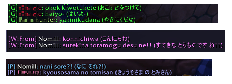

# Warcraft Addon: Romaji Translator

This add-on is for assisting Japanese chatting using Romaji typing. It displays the Hiragana version of the received Romaji messages in brackets automatically.

[Nihongo setumei page（日本語の説明ページ）](http://wp.me/pRxTt-1aK)

- Requires Unicode font.
- This addon don't touch outgoing message.
- You can set default enable/disable setting in Menu > Interface > Addon > Romaji Translator.
- Type `/romakana off` command to temporary disable this addon.
- Type `/romakana on` to enable again.

